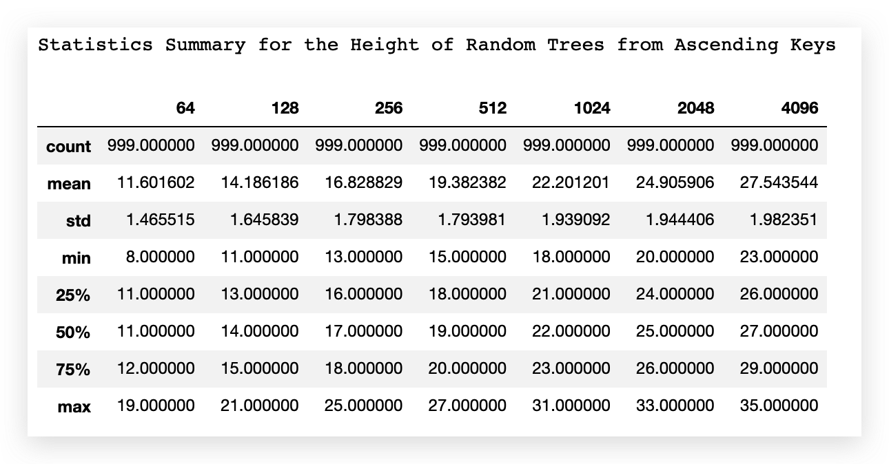
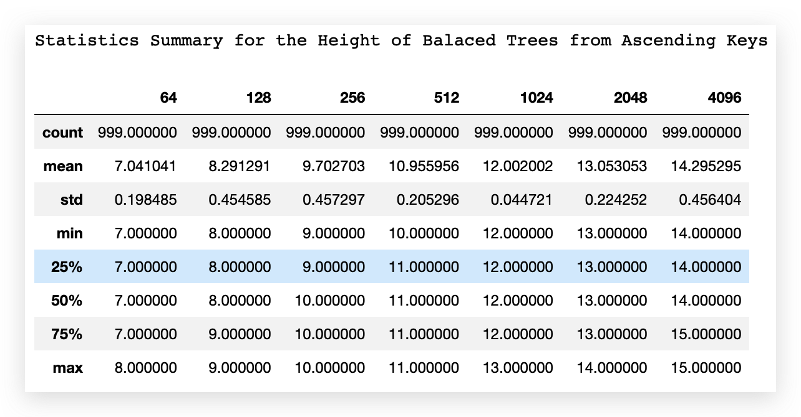
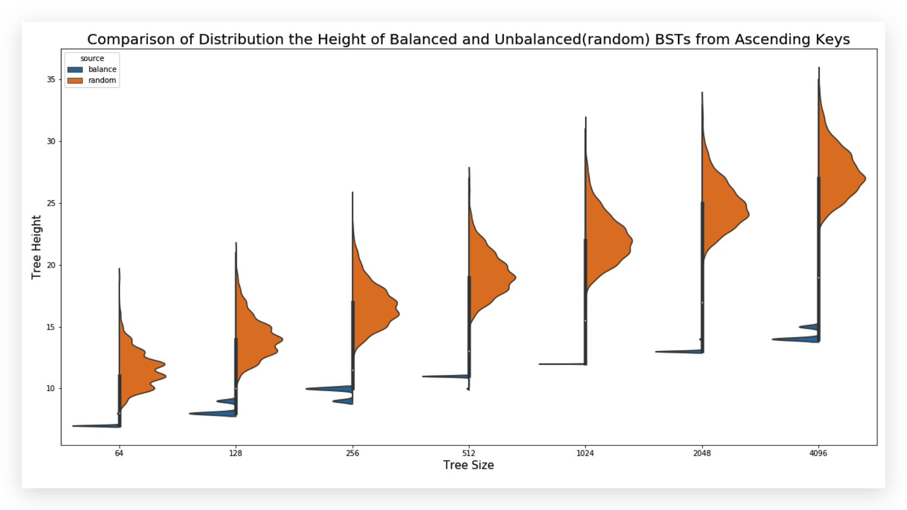
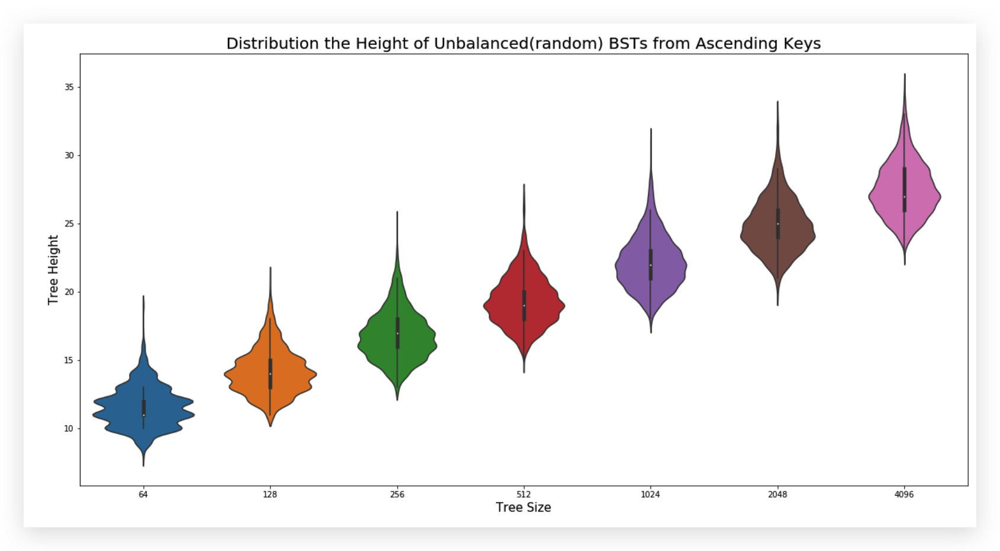
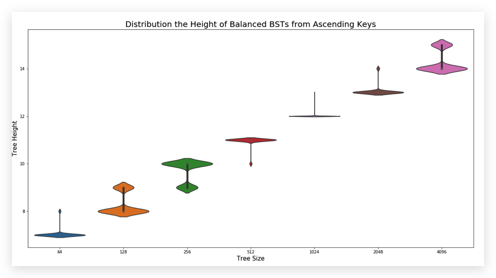
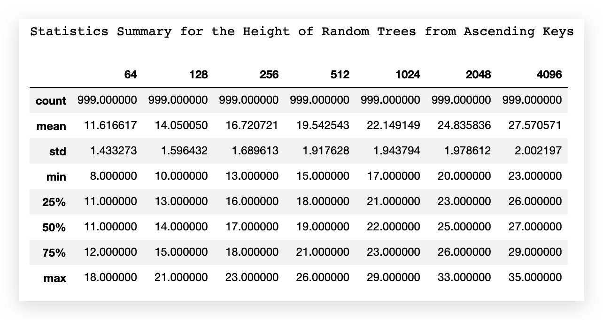
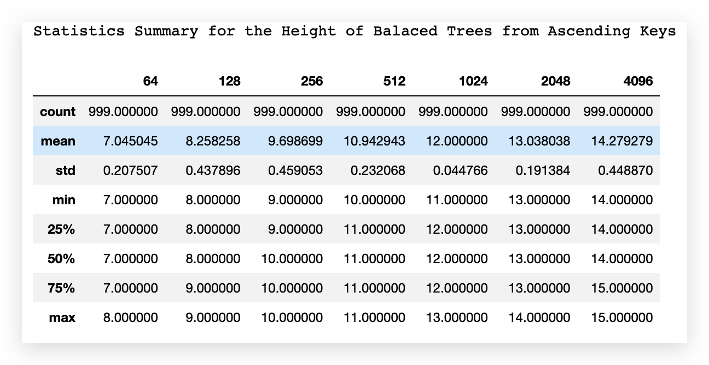
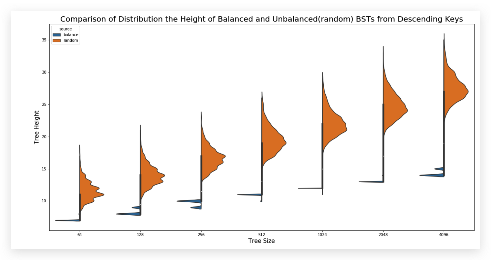
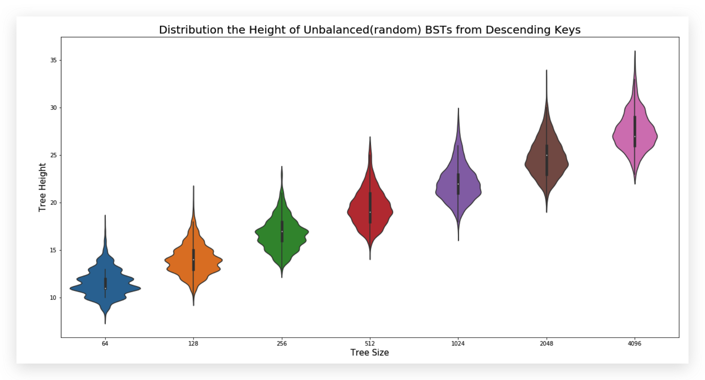
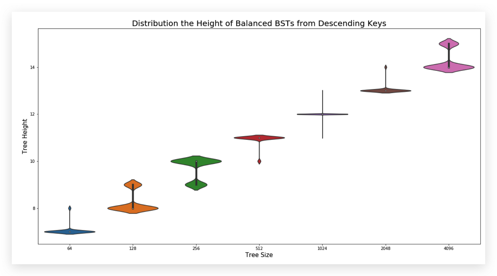

This is an implementation of AVL trees using Racket, a functional programming language. 

- `bst.rkt` is the implementation of AVL tree containing 
- `bst-examples.rkt` is the given example file 
- `bst-experiment*` are files for experimenting with different sizes of AVL tree 
- `output` is the folder containing the results from experiment. 

# Results

`output` folder contains all the data and analysis files. There are four `.csv` files in the `output` folder containing the size and height data of both random and blanced trees from ascending and descending keys. A short explanation for the files:

- `balanced_ascending.csv` tree height of balanced trees from ascending keys 
- `balanced_descending.csv`  tree height of balanced trees from descending keys 
- `random_ascending.csv`  tree height of random trees from ascending keys 
- `random_descending.csv` tree height of random trees from descending keys 
- `Analysis_ascending.ipynb`: jupyter notebook for analyzing trees from ascending keys. 
- `Analysis_descending.ipynb`: jupyter notebook for analyzing trees from descending keys. 

Each row in the data file represents the tree height for the size given. The first column contains the sizes we used (64, 128, 256, 512, 1024, 2048, and 4096). 

# Analysis
## Ascending Keys 

### Statistics Summary of Data

| Random Tree                                                  | Balanced Tree                                                |
| ------------------------------------------------------------ | ------------------------------------------------------------ |
|  |  |

### Graphs

| Random Tree                                                  | Balanced Tree                                                |
| ------------------------------------------------------------ | ------------------------------------------------------------ |
|  |  |

## Descending Keys

### Statistics Summary of Data

| Random Tree                                                  | Balanced Tree                                                |
| ------------------------------------------------------------ | ------------------------------------------------------------ |
|  |  |

### Graphs

| Random Tree                                                  | Balanced Tree                                                |
| ------------------------------------------------------------ | ------------------------------------------------------------ |
|  |  |

# Findings

Blanced BST have much shallower heights compared to a randomly generated BST. The height of a balanced BST mathces approximately $\log_2(\text{Size(tree)})$. The height of a random tree has a wider distribution, while the height of a balanced three has a very narrow variance. 

The results from ascending and descending keys does not differ a lot. 

# Credit

This is class homework of Grinnell College [CSC-301](https://rebelsky.cs.grinnell.edu/Courses/CSC301/2021Fa/syllabus/) taught by professor [Samuel A. Rebelsky](https://www.grinnell.edu/user/rebelsky). 

