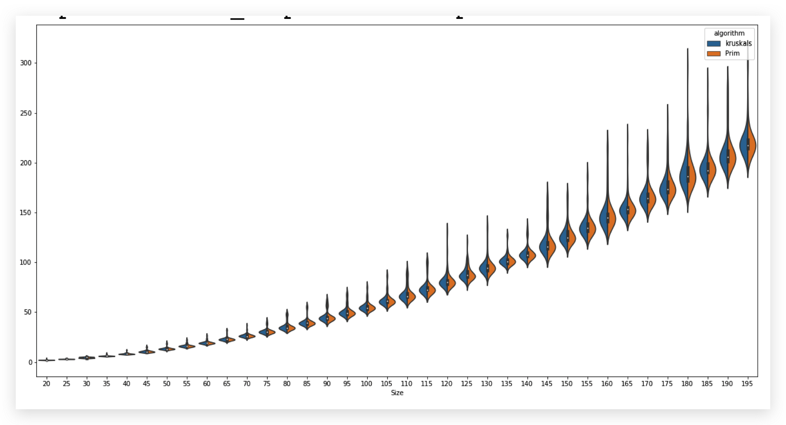

Implementation of Prim’s and Kruskal’s algorithms for finding a Minimum Spanning Tree in a graph. Comparison of time complexity between these two algorithms. 

Both algorithms and graph data structure are in `MST.ipynb`  jupyter notebook. 

# Data Structures

## Union Find

Union find is an efficient way to union and find elements in different sets. 

This is used in both Kruskal’s and Prim’s algorithms for determining  whether edges create cycles in a graph. An outline for the data structure is here. 

```python
class UnionFind:
    def __init__(self, n: int) -> None
    def find(self, node: int) -> int
    def union(self, rep1: int, rep2: int) -> None
```

## Graph

Graph data structure contains nodes and edges. 

```python
class Edge:
	def __init__(self, source: int, target: int, weight: int) -> None:
		self.source = source
		self.target = target
		self.weight = weight
	def __str__(self) -> str
	def __lt__(self, other

class Node:
	def __init__(self, key: int) -> None:
		self.key = key
		self.adj = {}
	def __str__(self) -> str
	def add_edge(self, edge: Edge) -> None
             
class Graph:
	def __init__(self, edgeList = None, nodeList = None) -> None:
		self.nodeList = {}
		self.edgeList = []
		if nodeList:
			for node in nodeList:
				self.add_node(node)
		if edgeList:
			for edge in edgeList:
				self.add_edge(edge)
	@staticmethod
	def random_graph(nodeSize: int)
  def __str__(self) -> str
	def add_node(self, nodeKey: int) -> None
	def add_edge(self, edge: Edge) -> bool
	def hasCycle(self) -> bool
	def calculate_weight(self) -> int
```

# Result

A comparison of running time for Kruskals and Prim’s algorithms. 



# Credit

This is class homework of Grinnell College [CSC-301](https://rebelsky.cs.grinnell.edu/Courses/CSC301/2021Fa/syllabus/) taught by professor [Samuel A. Rebelsky](https://www.grinnell.edu/user/rebelsky). 


