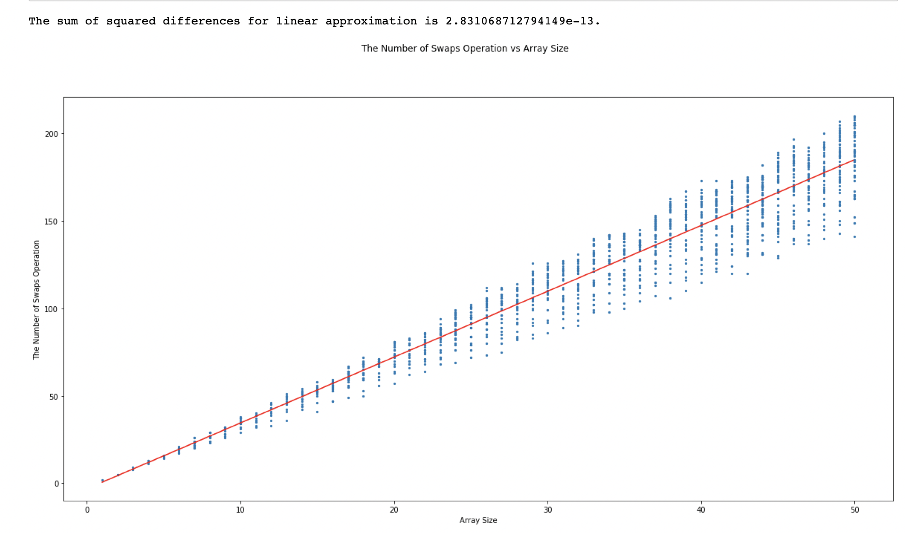

This is an implementation of kth smallest element in `C`. The algorithm is adapted from `quickSort` algorithm. The algorithm is able to find the kth smallest element in linear time. 

# File Cookbook

- `kth-core.h`, a header file that declares the `kth(int k, char *V[], int n)` function.
- `kth-core.c`, a file that defines the `kth` function.
- `strutils.h`, a header file defining some string utilities.
- `strutils.h`, a code file defining some string utilities. 
- `kth-tests.c`, a file that runs a set of tests that help verify the correctness of `kth` function. 
- `kth.c`, a file that defines the command-line interface for your `kth` function.
- `kth-experiments.c`, a file that runs experiments and prints out number of swap operations into a CSV.
- `kth-experiments.csv`, a file that contains the number of swap operations performed in the experiments.
- `Makefile`, the makefile for the project.
- `complexity-visualization.ipynb`: a jupyter notebook containning the visualization of csv file to show that the algorithm is linear time. 

# Analysis

To show our algorithm is correct, we can run `kth-tests.c`. To show the time complexity of our program, we can run `kth-experiments.c` and feed the output into `complexity-visualization.ipynb` to show that the alortihm runs in linear time. 

# Credit

This is class homework of Grinnell College [CSC-301](https://rebelsky.cs.grinnell.edu/Courses/CSC301/2021Fa/syllabus/) taught by professor [Samuel A. Rebelsky](https://www.grinnell.edu/user/rebelsky). 

