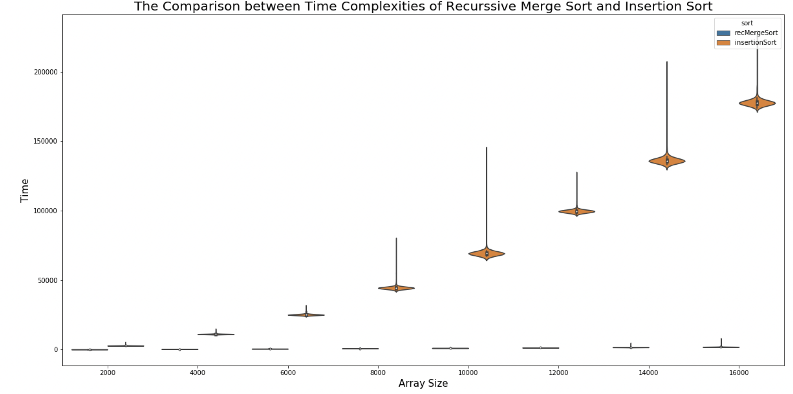
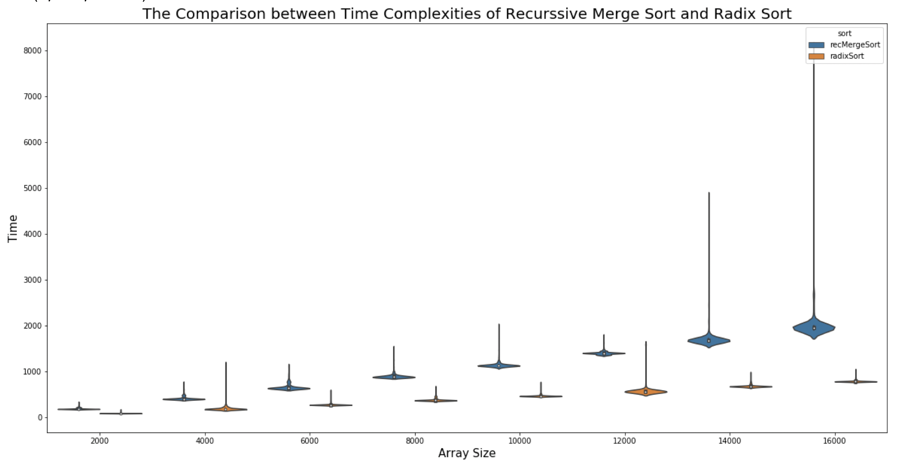
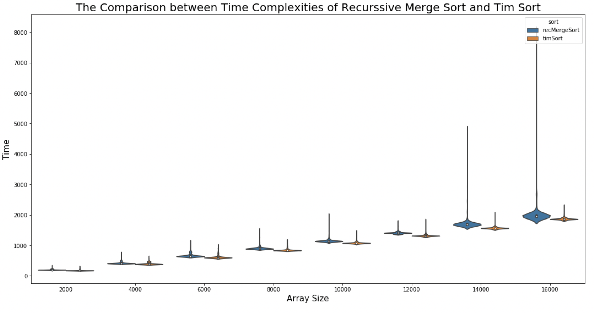
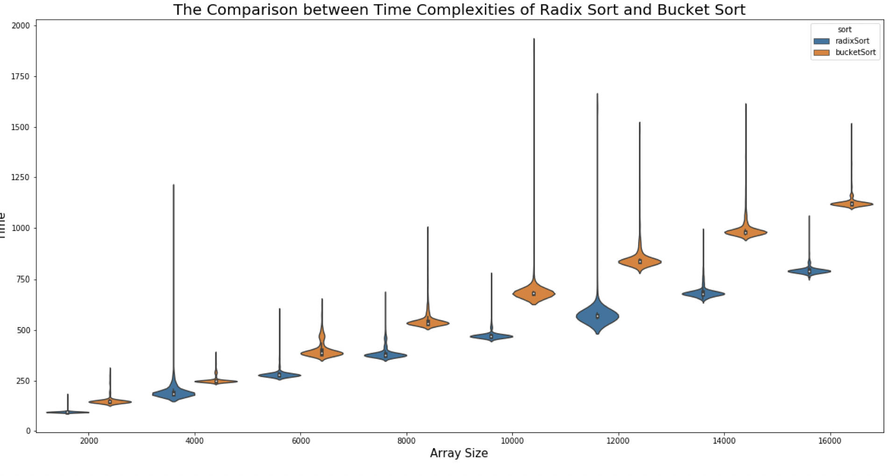

These are implementations of `insertion sort`, `recursive merge sort`, `tim sort`, `radix sort`, and `bucket sort`. All the implementations are in the folder `Codes` and the analysis of complexities of these sorting algorithms are in the folder `Analysis`. 

# File Cookbook

A short description of all the codes inside `Code` folder is below. 

- `Makefile`: a makefile for this project. Type `make` in the terminal to generate object files and excutables. 
- `test-*.c`: randomized test files for the sorting algorithms 
- `strutils.c`: various string and array utility functions 
- `competition.c`: competition code where all the sorting algorithms are executed on similar inputs. The runtime of different algorithms are written into different `csv` files which will be the input of our analysis. 
- Sorting algorithms
  - `insertion-sort.c`: implementation of insertion sort.
  - `recursive-merge-sort.c`: implementation of recursive merge sort. 
  - `tim-sort.c`: implementation of tim sort.
  - `radix-sort.c`: implementation of radix sort. This radix sort only works if strings in the array have length lower than 8 characters. 
  - `bucket-sort-3dArray.c`: implementation of bucket sort based on 3d arrays. Due to the problem of index overflow, the maximum array size for this algorithm is about 1200. Otherwise, we will have a segmentation error. 
  - `bucket-sort.c`: implementation of bucket sort based on bucket struct in `bucket.c` 

# Analysis

The analysis of different sorting algorithms is in `Analysis` folder. 

## Insertion Sort vs. Merge Sort

We can see that insertion sort which is an $O(n^2)$ algorithm is much slower than merge sort which is a $O(\log(n))$ complexity algorithm. 

## Merge Sort vs.Radix Sort

Merge sort is a $O(\log(n))$ algorithm, which is much slower than radix sort, which is a $O(n)$ algorithm. 

## Merge Sort vs. Tim Sort

Although both merge sort and tim sort are $O(\log(n))$ algorithms, Tim sort has a much better worst case performance than merge sort, because merge sort is slower than insertion sort when input size is small. Tim sort has a much better worst case performance. 

## Radix Sort vs. Bucket Sort

Both radix sort and bucket sort are $O(n)$ algorithms, but radix sort has a slightly better time complexity performance. Potential reason might be that since bucket sort use extra `bucket` strut. Both algorithms have linear time complexity. 

# Credit

This is class homework of Grinnell College [CSC-301](https://rebelsky.cs.grinnell.edu/Courses/CSC301/2021Fa/syllabus/) taught by professor [Samuel A. Rebelsky](https://www.grinnell.edu/user/rebelsky). 

